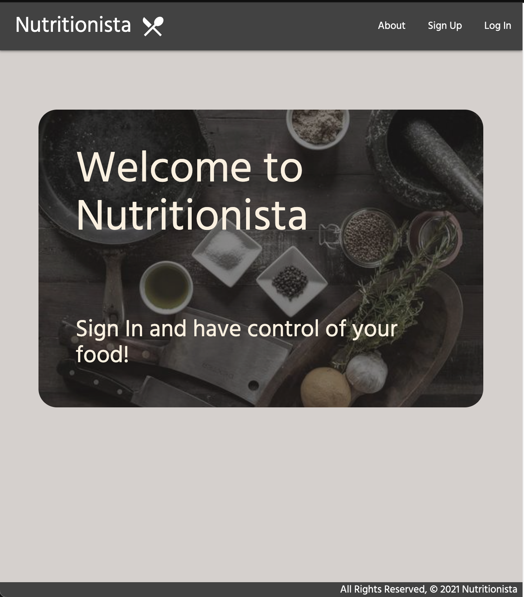
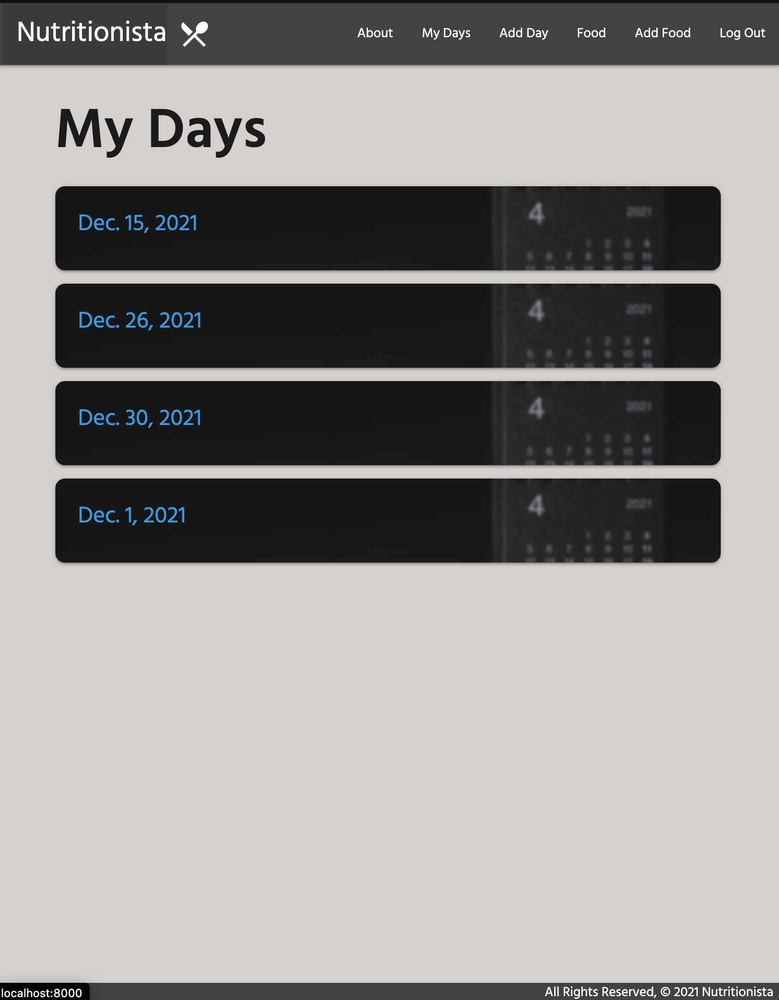
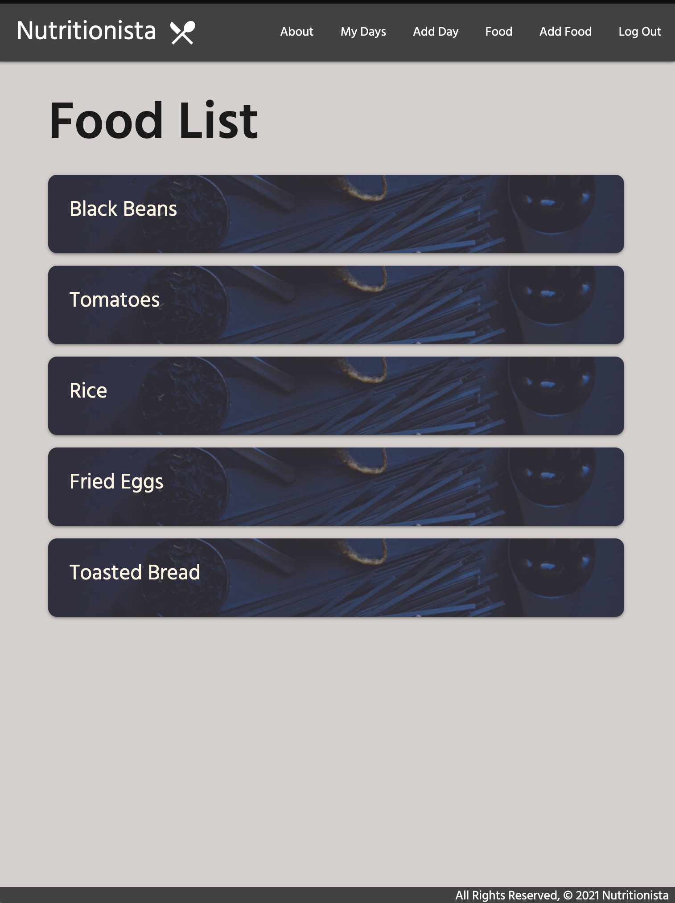
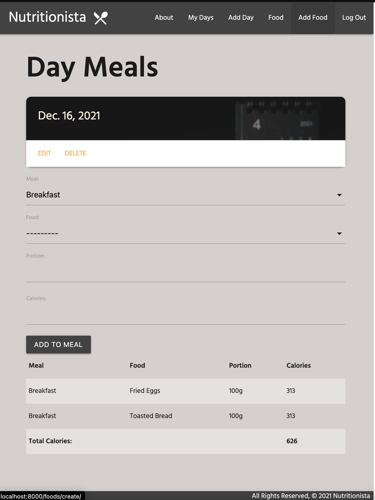
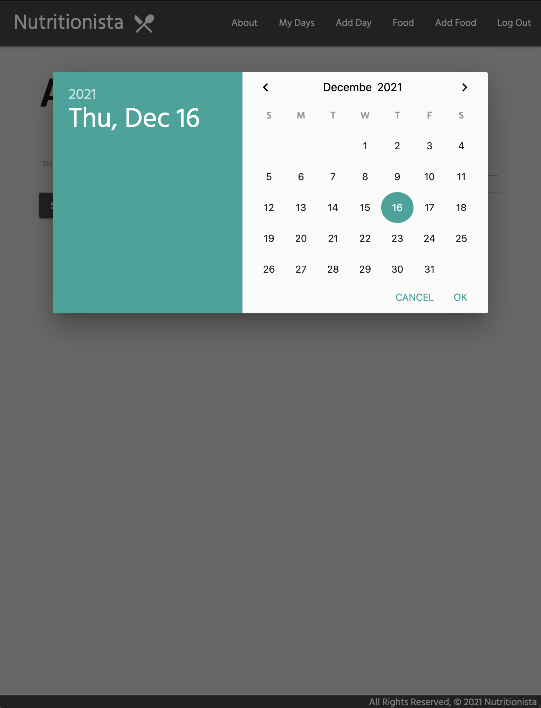

Nutritionista

Hello and welcome to Nutritionista!

Nutritionista is an application created for users to keep track of their calories. Everday you can add a list of food and meals that you ate and keep track of your caloric intake. Like a diary of your eating habits. This app can help improve your eating habits and aims to simplify dieting.

Screenshots:

Technologies Used:

- Python
- Django
- SQL
- Materialize
- CSS
- JavaScript
- Heroku

Try it out here:

https://nutritionista-app.herokuapp.com/

How to use the app:

- Sign up as a user
- You can start by creating a new day entry
- Add meals to your day and start tracking your daily calories
- You can select food from the list or add your own by creating new food entries
- Delete and edit days if there's something you would like to change

Future Additions:

- Implement API to select food
- Add photos of your meals
- Enter target calories each day
- Get weekly and monthly reports of your eating
